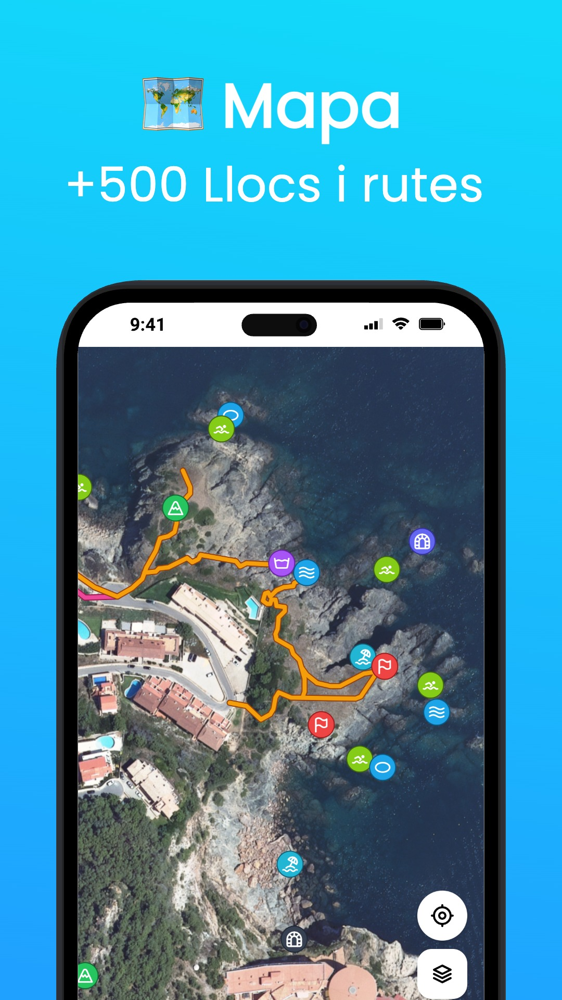
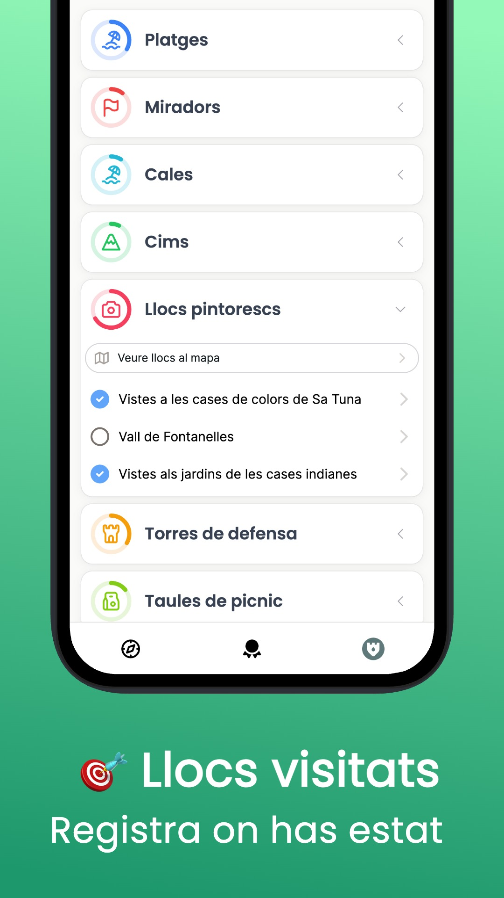
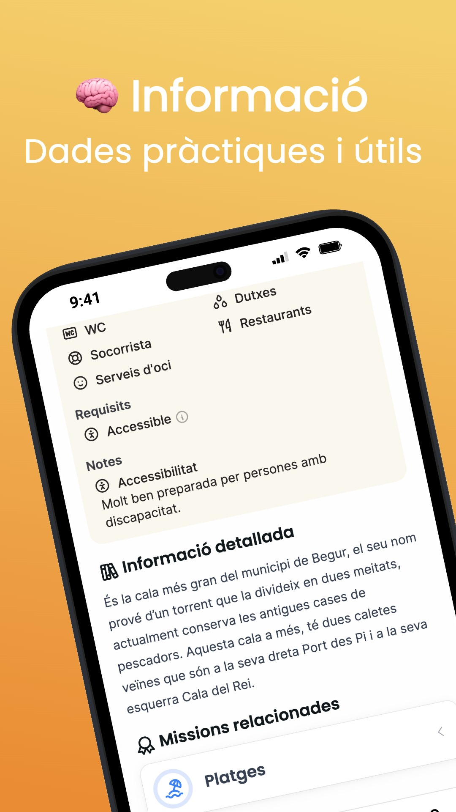

# Begur Secret App

Discover incredible places and explore Begur like never before.

<https://begursecret.com>

<p align="center" width="100%">
  
  
  
</p>

## Development

### Setup

1. Install [Node.js](https://nodejs.org/en/download/package-manager) and [pnpm](https://pnpm.io/)

   ```bash
   # Install Node.js first
   npm i -g pnpm
   ```

1. Create the file `.env.local`.

   - Copy the `.env.example` file and update the variables.
   - Or ask @mauriciabad for the file.

1. Install the project's dependencies:

   ```bash
   pnpm i
   ```

1. Run development server:

   ```bash
   pnpm dev
   ```

1. Open <http://localhost:3000> with your browser.

#### Using local database

> [!CAUTION]  
> This guide is outdated! The migration to Neon was very fast and I didn't have time to standarize the procedure.

By default, the app will connect to stage database in Neon, but you can run it locally too.

1. Install [docker](https://www.docker.com/products/docker-desktop/).
1. Run the database **in another console**:

   ```bash
   pnpm db:local:run-db
   ```

1. (Optional) Generate migrations if necessary:

   ```bash
   pnpm db:generate
   ```

1. Run database migrations:

   ```bash
   pnpm db:local:migrate
   ```

1. Run the app:

   ```bash
   pnpm db:local:run-app
   ```

1. (Optional) Visualize the data with Drizzle Studio in another console:

   ```bash
   pnpm db:local:studio
   ```

### Contributing

#### How to deploy changes in the database

> [!CAUTION]  
> This guide is outdated! The migration to Neon was very fast and I didn't have time to standarize the procedure.

1. Make the changes in your code, testing them with the local database.
1. Run `pnpm db:generate` to generate the migrations.
1. Run `pnpm db:push` to upload the migrations to Planetscale stage branch.
   - Only 1 branch can be pushed to Planetscale at a time, if there were contents from another change they will be overridden. This is because we use the Planetscale free tier.
1. Run the GitHub's CI after the stage database is updated, by pushing a commit or running it manually.
   - GitHub's CI is configured to run on stage database, so it will catch any error.
1. Right before merging the PR, go to Planetscale dashboard and create a deploy preview and deploy it.
1. Merge the PR in GitHub.

#### Access to other services

Ask @mauriciabad for access.

These are the services we use related to the code:

- [Neon](https://console.neon.tech/app/projects/spring-brook-65910694)
- [AWS S3](https://aws.amazon.com/s3)
- [Vercel](https://vercel.com/mauriciabad/begursecret)
- [GitHub](https://github.com/mauriciabad/begursecret)
- [Cloudflare](https://www.cloudflare.com)
- [Umami](https://analytics.eu.umami.is/websites/05dcd962-e08b-4cff-82a6-b0a62c4177a3)
- [Axiom](https://app.axiom.co/begursecret-7ctw/dashboards/vercel)
